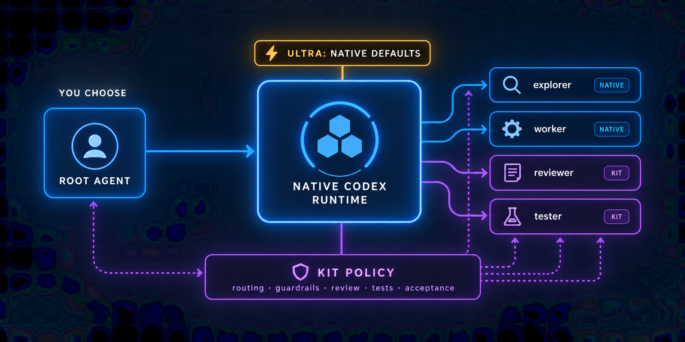

# Codex Subagent Kit

[](https://github.com/Charleyli925/codex-subagent-kit/actions/workflows/ci.yml)
[](LICENSE)

A practical operating system for Codex subagents: keep Codex's native
multi-agent runtime, then add predictable delegation, model routing, review,
testing, and result acceptance for real development work.



> Independent community project. It is not an official OpenAI repository.

[中文说明](README.zh-CN.md)

## Start with the user experience

You choose the root model and reasoning effort as usual. The kit does not change
that choice. During a substantial task, the root can hand bounded work to a small
team, continue useful non-overlapping work, then verify and combine the results.

```text
Your selected root agent — unchanged
├── explorer  — built into Codex; traces code and evidence
├── worker    — built into Codex; implements one bounded change
├── reviewer  — added by this kit; reviews from a clean, read-only context
└── tester    — added by this kit; runs existing tests against frozen source

Codex runs the threads. The kit supplies the operating policy.
```

That is why the repository defines only two custom agent TOML files even though
the working team has four roles: `explorer` and `worker` already ship with Codex,
while this kit adds only the missing `reviewer` and `tester` specializations.

For example, a feature task can send codebase discovery to `explorer`, keep the
critical implementation on the root, run a long deterministic suite through
`tester`, and ask `reviewer` to inspect the final diff with a fresh context. The
root remains responsible for authorization and acceptance. These roles are options,
not a mandatory pipeline; small changes can stay with the root.

## It uses Codex's native multi-agent runtime

This project does not reimplement subagents, ship a scheduler, or replace Codex's
orchestration. It deliberately joins the native runtime at its extension points.

| Codex already provides | This kit adds |
| --- | --- |
| Built-in `default`, `explorer`, and `worker` roles | Model-neutral `reviewer` and `tester` roles |
| Agent-thread creation and parallel execution | Rules for deciding when delegation is worthwhile |
| Follow-up instructions, waiting, stopping, and thread lifecycle | Dependency waves, one-writer ownership, and bounded concurrency |
| Parent model/effort inheritance and explicit spawn overrides | Portable inheritance and optional Sol/Astra routing policies |
| Parent permissions plus per-agent sandbox overrides | Read-only review and frozen-source test contracts |
| Thread activity and consolidated results | Task packets, route evidence, and root-side result acceptance |

The public Codex documentation describes these current subagent capabilities and
the built-in roles. Some local session records may label the runtime
`multi_agent_version: "v2"`; this repository uses that native runtime when the
client provides it, but **does not create a second V2 system and does not require
the undocumented `[features].multi_agent_v2` switch**. Its compatibility contract
is the documented `[agents]` and `.codex/agents/` surface.

## The opinionated choices in `sol-astra`

The optional `sol-astra` preset encodes choices rather than pretending they are
Codex defaults:

1. **Ultra passes through.** Sol Ultra and Astra Ultra keep Codex-native
   delegation, model selection, and runtime thread selection. The kit does not
   force its non-Ultra role routing or three-child policy onto Ultra.
2. **Every non-Ultra Sol/Astra effort uses the child routing policy.** Low,
   Medium, High, XHigh, and Max keep the user's chosen root model and effort, but
   delegated children may use a different model.
3. **Narrow work goes to a fast agent at high effort.** `explorer`, `worker`, and
   `tester` use Luna Max for bounded exploration, implementation, and test work.
4. **Review does not deliberately become weaker than the root.** `reviewer` uses
   the same model family as the root, has a High floor, and follows the root up to
   XHigh or Max. Its independent context and review instructions provide the
   second opinion.
5. **Unknown models stay portable.** If the root is neither Sol nor Astra,
   children inherit it. If an explicit route is unavailable, the policy records
   the failure and allows one inherited fallback.

These defaults are all editable. They are a worked example of separating a
role's responsibility from the model used to perform it.

## How Luna workers get useful work

Sol and Astra share the same coordination rules. In the `sol-astra` preset,
the root settles key decisions before handing implementation to Luna Max:
intended behavior, relevant code, interfaces to preserve, allowed scope and
acceptance scenarios. It resolves critical ambiguity without prescribing every
line or doing the implementation first.

Each worker request includes a short execution agreement. The worker reads the
implementation and relevant callers/types/tests, handles local details and
necessary test additions, and self-checks its change without a plan-approval
round trip. Ordinary type/helper differences are local decisions; new facts that
invalidate assumptions, change agreed behavior/interfaces or require broader
authority go back to the root with evidence. Safe unaffected work may continue.

Complex multi-file work can fit this handoff. Luna does not take every
implementation: the root retains or takes back work that still needs continuous
design or costs more to hand off than to do directly. No dynamic Worker upgrade
or extra role is involved.

Tester runs specified checks on frozen source; reviewer independently checks
correctness, not just adherence to the plan. The root reuses evidence while its
source, configuration, environment and coverage remain applicable, and repeats
affected checks when they change or a failure or new concern warrants it.
Authorized implementation continues through acceptance, not merely a first draft.

## What we learned from native/Ultra behavior

The policy adopts the useful visible principles of the native workflow without
depending on hidden Ultra configuration:

- delegate independent work when it materially improves speed or quality;
- move noisy exploration, logs, and test output out of the root context;
- give each child a narrow goal and clean context;
- let the root continue instead of waiting when results are not yet dependencies;
- steer or stop work that becomes stale, duplicated, or out of scope;
- return distilled evidence, then let the root verify it.

The kit adds explicit coordination rules that a runtime cannot infer for every
repository: source identity, file ownership, dependency state, required reading,
stop conditions, model-route evidence, and explicit result acceptance.

## When will it delegate?

The `portable` and `sol-astra` presets let the root delegate proactively when a
task is concrete, bounded, independent, and likely to benefit from parallel work.
The `minimal` preset delegates only after a direct request or when a substantial
task has clearly independent lanes.

Good candidates include codebase exploration, long existing test suites, log
analysis, issue triage, independent review, and summarization. Short edits,
irreversible actions, critical-path decisions, and work that needs continuous
shared judgment stay on the root.

At the selected preset's delegation entry point, the root loads the detailed
orchestration contract on demand. This is progressive disclosure: every task sees the short
policy, but only actual multi-agent work pays the context cost of the full rules.

## Requirements

- A current local Codex client with subagent support.
- Bash 3.2 or newer for installation.
- Python 3.11 or newer for `doctor.sh` TOML validation and repository tests.

## Quick start

Clone the repository, preview the installation, then apply it to a project:

```bash
git clone https://github.com/Charleyli925/codex-subagent-kit.git
cd codex-subagent-kit
./scripts/install.sh --preset portable --project /absolute/path/to/project
./scripts/install.sh --preset portable --project /absolute/path/to/project --apply
./scripts/doctor.sh --project /absolute/path/to/project
```

The installer never overwrites an existing `AGENTS.md`, `.codex/config.toml`,
`reviewer.toml`, or `tester.toml`. When one already exists, it installs a
reviewable source copy under `.codex/subagent-kit/` and prints the manual merge
step. Existing payload files are preserved too; repeat installation does not
refresh old rules. See [Updating an existing project](#updating-an-existing-project).

Start a new Codex session from the project root after installation. Codex loads
project-scoped agents when the session starts.

## Presets

| Preset | Delegation | Model routing | Best for |
| --- | --- | --- | --- |
| `portable` | Proactive when parallel work materially helps | Children inherit the root unless explicitly overridden | Most projects |
| `sol-astra` | Proactive below Ultra; native Ultra behavior | Luna Max for exploration/work/tests; aligned Sol/Astra reviewer | The opinionated routing used by the originating workflow |
| `minimal` | Direct request or clearly independent lanes | Inherit the root | Small repositories and cautious adoption |

The portable preset is the default because model availability varies by account,
client, and time. The Sol/Astra preset is optional and documents its fallback.
To adopt the complete opinionated policy described above, replace `portable`
with `sol-astra` in both install commands.

## Roles

| Role | Source | Permission intent | Responsibility |
| --- | --- | --- | --- |
| `explorer` | Built into Codex | Read-heavy | Trace files, execution paths, state, and risks |
| `worker` | Built into Codex | Workspace write | Implement one bounded change |
| `reviewer` | This kit | Read-only | Independently find correctness, regression, and test risks |
| `tester` | This kit | Workspace write | Run existing tests and collect evidence without editing source |

The parent agent remains responsible for authorization, routing, conflict
avoidance, steering, integration, and final acceptance.

## Installed files

For a clean project, installation activates:

```text
AGENTS.md
.codex/config.toml
.codex/agents/reviewer.toml
.codex/agents/tester.toml
.codex/subagent-kit/
```

The `.codex/subagent-kit/` directory contains the selected preset and the
progressively disclosed operating contracts. It is also the source used for
manual merging when a project already owns one of the active files.

## Updating an existing project

Review the current kit source against your installed files, preserving local
customizations. Rerunning the installer fills missing files; it does not update
different active files **or an old payload**. A preserved payload is not proof
that an upgrade was installed.

| Current kit source | Review and merge into the project |
| --- | --- |
| `presets/<selected>/AGENTS.md` | `AGENTS.md` and `.codex/subagent-kit/AGENTS.snippet.md` |
| `presets/<selected>/config.toml` | `.codex/config.toml` and `.codex/subagent-kit/config.toml` |
| `core/agents/*.toml` | `.codex/agents/` and `.codex/subagent-kit/agents/` |
| `rules/*.md` | `.codex/subagent-kit/` |

Review the changes together so entry points, task packets and role instructions
agree. Run `doctor.sh` and start a new Codex session from the project root;
already-running sessions do not automatically reload their context.

## Why progressive disclosure

The root `AGENTS.md` stays short. It tells the root agent when delegation is
appropriate and points to `.codex/subagent-kit/orchestration.md` before delegation
under that preset; Sol/Astra Ultra keeps its native exception. Each child receives only a self-contained
task packet plus its task-specific `required_reading` list.

Task reading is scoped and unchanged material can be reused. This controls
explicit reading and handoffs, not Codex's automatically injected instructions
or runtime context inheritance.

## Sol/Astra routing

The optional preset uses this policy below Ultra:

| Root selection | `explorer` / `worker` / `tester` | `reviewer` |
| --- | --- | --- |
| Sol Low, Medium, or High | `gpt-5.6-luna` / `max` | `gpt-5.6-sol` / `high` |
| Sol XHigh | `gpt-5.6-luna` / `max` | `gpt-5.6-sol` / `xhigh` |
| Sol Max | `gpt-5.6-luna` / `max` | `gpt-5.6-sol` / `max` |
| Astra Low, Medium, or High | `gpt-5.6-luna` / `max` | `gpt-6-astra` / `high` |
| Astra XHigh | `gpt-5.6-luna` / `max` | `gpt-6-astra` / `xhigh` |
| Astra Max | `gpt-5.6-luna` / `max` | `gpt-6-astra` / `max` |
| Sol or Astra Ultra | Codex-native routing | Codex-native routing |
| Any other root | Inherit root | Inherit root |

The custom role files intentionally do not pin models. Dynamic reviewer
alignment is a parent-agent routing decision made at spawn time.

Only the `sol-astra` preset applies this table. It changes child routing for all
non-Ultra Sol/Astra reasoning levels; it does not change the model or effort you
selected for the root agent.

## Make the policy yours

The presets are starting points, not hidden defaults. The installed files are
plain TOML and Markdown that belong to the consuming project.

| Choice | Shipped value | Where to change it |
| --- | --- | --- |
| Proactive vs. explicit delegation | Preset-dependent | Installed `AGENTS.md` policy |
| Maximum open children | `portable`: 3; `minimal`: 2; `sol-astra`: 3 below Ultra and native in Ultra | Preset config and installed `AGENTS.md` |
| Child models and efforts | Inherit, or the Sol/Astra table | Installed `AGENTS.md` routing section |
| Reviewer minimum effort | High in `sol-astra` | Reviewer alignment table |
| Ultra behavior | Native pass-through | Ultra routing rule |
| Writable concurrency | One writer | `.codex/subagent-kit/orchestration.md` |
| Whether children may spawn | No | Root policy and custom-agent instructions |
| Missing-model fallback | One inherited retry | Routing and orchestration rules |
| Project documents children must read | Task-specific | Each task packet's `required_reading` |
| Role behavior and sandbox intent | Reviewer/tester defaults | `.codex/agents/*.toml` |

You can also add your own role. Create `.codex/agents/security-reviewer.toml`,
give it the required fields, then add when-to-use and routing rules to your
project's `AGENTS.md`:

```toml
name = "security_reviewer"
description = "Review a bounded diff for concrete security regressions."
sandbox_mode = "read-only"
developer_instructions = """
Review only the supplied diff and threat boundary. Do not edit files or spawn
other agents. Return findings with file evidence and residual limits.
"""
```

Keep the new role narrow. Decide separately whether it inherits the root model,
uses a project default, or receives an explicit model and reasoning effort at
spawn time. Then include it in the same task-packet and result-acceptance loop as
the bundled roles.

## Safety properties

- At most three open child threads in the configured non-Ultra policies; the Sol/Astra Ultra path keeps native thread selection.
- Only one agent writes a checkout at a time, including test artifacts.
- Read-only tasks may run in parallel against frozen source.
- Leaf agents do not spawn more agents.
- Child summaries are leads, not acceptance proof.
- A route mismatch blocks acceptance of child code changes.
- Delegation never expands the user's authorization.
- Existing project configuration is never overwritten by the installer.

## Validation

Run the repository checks:

```bash
bash tests/test-kit.sh
```

The checks parse every TOML file, exercise clean and preconfigured project
installation for all presets, verify dry-run and update-preservation behavior,
and check installed references and model-neutral roles. These static checks and
scenario walkthroughs are not live multi-agent tests or guarantees of Luna's
implementation quality.

## Compatibility

The kit follows the public Codex subagent configuration documented at
<https://learn.chatgpt.com/docs/agent-configuration/subagents>.

It uses `[agents]`, `.codex/agents/*.toml`, `model`,
`model_reasoning_effort`, and `sandbox_mode`. It intentionally does not require
`[features].multi_agent_v2`. Custom-agent authoring and sharing may evolve, so
runtime compatibility is tracked in [docs/compatibility.md](docs/compatibility.md).
Our shared prompt cleanup also draws on the official
[skills and prompts guidance](https://developers.openai.com/blog/rethinking-skills-and-prompts-for-gpt-6-astra).
The kit's Luna routing and handoff policy are project choices, not official
quality guarantees or Astra-specific instructions.

## Project adapters

Product-specific test commands, release rules, architecture contracts, and
approval policies do not belong in the shared core. Add them to the consuming
project's `AGENTS.md` and pass the relevant paths through each task packet's
`required_reading` field.

See [adapters/example-project/AGENTS.md](adapters/example-project/AGENTS.md) for
a small example.

## License

Apache License 2.0. See [LICENSE](LICENSE) and [NOTICE](NOTICE).
